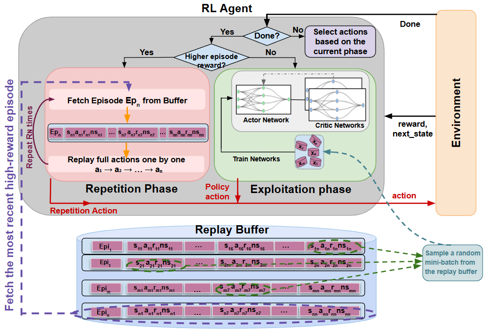

# Instant Episode Repetition (IER)

Official implementation of **Instant Episode Repetition (IER)**, introduced in our RLC 2026 paper:

> **Repetition as Reinforcement: Enhancing Sample Efficiency via Instant Episode Repetition in Reinforcement Learning**  
> *Yamani et al., Reinforcement Learning Conference (RLC), 2026*

<p align="center">
  
</p>

<p align="center">
  <b>Instant Episode Repetition (IER)</b>: when a new high-reward episode is discovered, its action sequence is immediately re-executed for a fixed number of subsequent episodes.
</p>

---

## Overview

Reinforcement Learning (RL) agents often require a large number of environment interactions to learn effective policies. This becomes particularly challenging in real-world applications, where data collection can be expensive, slow, or difficult.

**Instant Episode Repetition (IER)** is a simple interaction-level mechanism designed to improve sample efficiency by actively revisiting successful behaviour.

Unlike conventional approaches such as Experience Replay and Self-Imitation Learning (SIL), which reuse previous experience during policy updates, IER directly modifies the **data collection process**.

When the agent discovers an episode with a new highest cumulative reward, IER stores the corresponding action sequence and immediately re-executes it for a fixed number of subsequent episodes.

This allows the agent to collect additional experience around behaviours that have already demonstrated high value.

---

## Core Idea

Consider an episode

```math
\tau = \{(s_0,a_0,r_0), \ldots, (s_T,a_T,r_T)\}
```

with cumulative episode reward

```math
R_{\mathrm{ep}}(\tau)
=
\sum_{t=0}^{T} r_t
```

IER keeps track of the highest episode reward observed so far, denoted by $R_{\max}$.

If the current episode achieves a new maximum reward,

```math
R_{\mathrm{ep}}(\tau) > R_{\max}
```

IER stores the corresponding action sequence

```math
\mathbf{a}^{*}
=
(a_0^{*}, a_1^{*}, \ldots, a_T^{*})
```

and updates the best observed reward.

The agent then enters **repetition mode** for $RN$ consecutive episodes, where $RN$ is the Repetition Number controlling the strength of repetition.

During normal interaction, actions are selected from the current policy:

```math
a_t \sim \pi_{\theta}(\cdot \mid s_t)
```

During repetition, the policy-selected action is temporarily replaced by the corresponding action from the stored successful sequence:

```math
a_t = a_t^{*}
```

After the $RN$ repetition episodes are completed, the agent returns to standard policy-driven interaction.

All transitions collected during both normal interaction and repetition are stored in the replay buffer and used for standard off-policy updates.

Therefore, IER changes **how new experience is collected**, while leaving the underlying RL network architecture, objective functions, and optimisation procedure unchanged.
---

## Interaction Modes

IER can be viewed as introducing three modes of interaction:

### 1. Exploration

During the initial exploration phase, actions are selected to gather diverse experience and populate the replay buffer.

### 2. Exploitation

During normal interaction, actions are generated by the current RL policy.

### 3. Repetition

When a new highest-reward episode is discovered, its action sequence is stored and immediately re-executed for a predefined number of episodes.

All transitions collected during these modes are inserted into the standard replay buffer and used for normal off-policy learning.

---

## Why Re-execute Instead of Replay?

IER is different from conventional Experience Replay.

Experience Replay stores transitions and later samples them again during gradient updates.

IER instead **re-executes the successful action sequence in the environment**.

The repeated episode is therefore not necessarily an exact duplicate of the original trajectory.

Different initial states, environment stochasticity, sensor noise, contact dynamics, and actuation uncertainty can lead to different state trajectories even when the same action sequence is executed.

IER therefore concentrates additional interaction around promising behaviours while continuing to collect new experience.

---

## Simple Integration

IER operates at the **interaction level**.

It does not require changes to:

* network architectures,
* reward functions,
* actor or critic loss functions,
* optimisation procedures.

The underlying RL algorithm continues to train normally using transitions stored in the replay buffer.

This makes IER straightforward to integrate with standard off-policy RL algorithms.

---

## Supported Algorithms

IER is evaluated with two widely used continuous-control algorithms:

* **Soft Actor-Critic (SAC)**
* **Twin Delayed Deep Deterministic Policy Gradient (TD3)**

The corresponding IER variants are referred to as:

* **IER-SAC**
* **IER-TD3**

---

## Repetition Number (RN)

The **Repetition Number (RN)** controls how many consecutive episodes re-execute the stored high-reward action sequence.

For example:

```text
RN = 0  → Standard RL without repetition
RN = 1  → Repeat the successful episode once
RN = 2  → Repeat it for two subsequent episodes
RN = 3  → Repeat it for three subsequent episodes
```

In the paper, we evaluate repetition numbers from:

```text
RN ∈ {0, 1, 2, 3, 4, 5, 6, 7}
```

The results show that moderate repetition is generally the most effective, although the optimal RN depends on the task and underlying RL algorithm.

---

## Evaluation

IER is evaluated across eight continuous-control benchmark tasks and a real-world robotic manipulation task.

### MuJoCo

* Ant
* HalfCheetah
* Humanoid
* Hopper

### DeepMind Control Suite

* Walker-Walk
* Cheetah-Run
* Cartpole-Swingup
* Finger-Turn-Hard

### Real-World Robotic Manipulation

IER is also evaluated on a physical two-finger robotic manipulation system performing a dynamic object translation task.

The real-world experiment introduces additional sources of variability, including:

* sensor noise,
* actuation uncertainty,
* friction,
* contact dynamics,
* variation between repeated executions.

This experiment demonstrates that IER can remain effective beyond simulated environments.

---

## Main Findings

Experiments in the paper show that IER can:

* improve sample efficiency,
* accelerate convergence,
* increase performance across a range of continuous-control tasks,
* reinforce useful behavioural sequences,
* operate with both SAC and TD3,
* transfer from simulation to real-world robotic interaction.

The results demonstrate that successful behaviours can be reused not only through replay-buffer updates, but also through **direct repetition during environment interaction**.

---

## Repository Structure

```text
instant-episode-repetition/
│
├── assets/
│   └── IER.png
│
├── algorithms/
│   ├── base/
│   └── repetition/
│
├── configs/
│   └── ier/
│
├── environments/
│
├── memory/
│
├── networks/
│
├── train_loops/
│   ├── base/
│   └── ier/
│
├── utils/
│
├── train.py
├── README.md
├── LICENSE
└── .gitignore
```

The main IER interaction logic is located in:

```text
train_loops/ier/
```

The remaining modules provide the SAC/TD3 implementations, replay memory, neural networks, environment interfaces, and training utilities required to run the experiments.

---

## Installation

Clone the repository:

```bash
git clone https://github.com/UoA-CARES/instant-episode-repetition.git
cd instant-episode-repetition
```

We recommend using a dedicated Python environment.

For example, using Conda:

```bash
conda create -n ier python=3.10
conda activate ier
```

or using Python `venv`:

```bash
python -m venv .venv
```

On Windows:

```bash
.venv\Scripts\activate
```

On Linux/macOS:

```bash
source .venv/bin/activate
```

Install the project dependencies according to the environment requirements provided with the repository.

---

## Running IER

IER experiments are controlled through YAML configuration files located under:

```text
configs/ier/
```

The general command is:

```bash
python train.py run --config configs/ier/<configuration-file>.yaml
```

The configuration determines parameters such as:

* RL algorithm,
* environment,
* random seed,
* training duration,
* exploration settings,
* repetition strategy,
* Repetition Number (RN).

---

## IER Training Logic

At a high level, IER follows the procedure below:

```text
Initialize RL agent
Initialize replay buffer
Initialize best episode reward
Initialize repetition counter

for each environment interaction:

    if initial exploration:
        select exploratory action

    else if repetition is active:
        execute action from stored successful episode

    else:
        select action from current policy

    execute action in environment

    store transition in replay buffer

    update SAC / TD3 normally

    if episode terminates:

        compute cumulative episode reward

        if reward > best reward:

            store current action sequence
            update best reward
            activate repetition for RN episodes

        else if repetition is active:

            decrease repetition counter

        reset environment
```

The key distinction is that repetition changes **which actions are executed during environment interaction**, while the underlying RL optimisation remains unchanged.

---

## Paper

**Repetition as Reinforcement: Enhancing Sample Efficiency via Instant Episode Repetition in Reinforcement Learning**

**Authors:**
Hoda Yamani, Yuning Xing, Koen van Rijnsoever, Bruce A. MacDonald, and Henry Williams

**Conference:**
Reinforcement Learning Conference (RLC), 2026

**Affiliation:**
Robot Learning Team
Centre for Automation and Robotic Engineering Science (CARES)
Department of Electrical, Computer and Software Engineering
University of Auckland, New Zealand

---

## Citation

If you use IER or this repository in your research, please cite:

```bibtex
@inproceedings{yamani2026repetition,
  title     = {Repetition as Reinforcement: Enhancing Sample Efficiency via Instant Episode Repetition in Reinforcement Learning},
  author    = {Yamani, Hoda and Xing, Yuning and van Rijnsoever, Koen and MacDonald, Bruce A. and Williams, Henry},
  booktitle = {Reinforcement Learning Conference},
  year      = {2026}
}
```

---

## Code

Repository:

```text
https://github.com/UoA-CARES/instant-episode-repetition
```

---

## Authors

This work was developed by the **Robot Learning Team** at the **Centre for Automation and Robotic Engineering Science (CARES), University of Auckland, New Zealand**.

---

## License

This repository is released under the terms provided in the [LICENSE](LICENSE) file.

---

## Acknowledgements

We thank the members of the Robot Learning Team at the University of Auckland's Centre for Automation and Robotic Engineering Science (CARES) for their support and contributions to this work.
